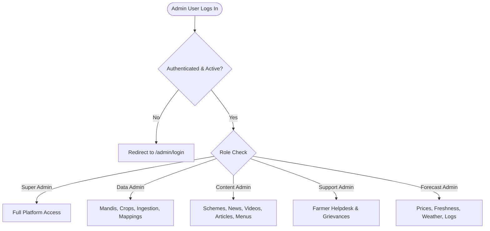

# Implementation Plan: Admin Profile Settings & Role-Based Access Control (RBAC)

**Project:** Krushi Baandhava Admin Panel  
**Date:** October 2026  
**Status:** Approved & In-Progress  
**Location in Docs:** `docs/ADMIN_PROFILE_AND_ROLE_MANAGEMENT_PLAN.md`

---

## 1. Executive Summary & Objective

Currently, the Krushi Baandhava Admin Panel uses a single general administrator authentication gate. While the `User` model defines role constants (`super_admin`, `data_admin`, `forecast_admin`, `content_admin`, `support_admin`), there are:
1. **No Profile Settings pages** for logged-in administrators to manage their personal details, phone number, language preference, or passwords.
2. **No Role & Staff Management module** to view, invite, or manage administrators with tailored access levels.
3. **No role-based UI filtering or route enforcement**, allowing any administrator full access to critical operations such as database pruning, feature flags, and price ingestion.

This implementation plan delivers a production-grade, secure, multi-tier administration framework.

---

## 2. Architecture & Role Permissions Matrix

### Role Breakdown

| Role Constant | Title & Scope | Permitted Admin Modules | Restricted Modules |
| :--- | :--- | :--- | :--- |
| `ROLE_SUPER_ADMIN` | **Super Administrator** (Platform Owner) | **Everything**: System Settings, Database Pruning, Staff Management, Feature Flags, CMS, Ingestion, Audit Logs. | None |
| `ROLE_DATA_ADMIN` | **Market & Data Administrator** (Mandi Operator) | APMC Mandis, Crops & Varieties, Data Sources, Deployment Hub, Prices, Ingestion Logs, Unresolved Mappings, Data Quality. | Staff/Roles, System Settings, Feature Flags, Pruning. |
| `ROLE_CONTENT_ADMIN` | **Agricultural Content Editor** (Agronomist) | Government Schemes, Agri News, YouTube Educational Videos, Agronomy Articles, Navigation & Footers. | Price Ingestion, Master Mandis, System Settings, Staff. |
| `ROLE_SUPPORT_ADMIN` | **Farmer Support Officer** (Helpdesk CRM) | Farmer Helpdesk & Grievance CRM, Feedback Settings, Admin Notes & Guidelines. | Master Data, Prices, API Sources, Settings, Staff. |
| `ROLE_FORECAST_ADMIN` | **Price & Market Analyst** (Analyst) | Market Prices, Price Freshness & Staleness Rules, Weather Management, Audit Trail Logs. | User Creation, System Credentials, System Pruning. |

---

## 3. Database Enhancements

Add two columns to the `users` table via migration:
1. `is_active` (`BOOLEAN`, default `TRUE`): Enables immediate account suspension without deleting past audit history.
2. `last_login_at` (`TIMESTAMP`, nullable): Tracks staff activity and dormancy.

---

## 4. Phase-by-Phase Implementation Plan

### Phase 1: Database Migration & Model Enhancements
- [x] Create migration `add_active_and_login_tracking_to_users_table`.
- [x] Run `php artisan migrate`.
- [x] Update `app/Models/User.php`:
  - Add `is_active` and `last_login_at` to `$fillable` and `$casts`.
  - Add helper methods: `getRoleBadgeClass()`, `getRoleTitle()`, `canAccessModule(string $module)`.
- [x] Update `app/Http/Controllers/Admin/AuthController.php` to reject suspended accounts (`is_active = false`) and update `last_login_at` on successful authentication.

### Phase 2: Admin Profile & Security Settings (`/admin/profile`)
- [ ] Create `app/Http/Controllers/Admin/ProfileController.php`:
  - `edit()`: Render profile view with tabs (Account Profile, Password Change, Activity Snippet).
  - `update()`: Validate & update name, phone, preferred_language (`kn`/`en`), district_id.
  - `updatePassword()`: Validate current password and update new hashed password.
- [ ] Add routes to `routes/web.php`:
  - `GET /admin/profile` (`admin.profile.edit`)
  - `PUT /admin/profile` (`admin.profile.update`)
  - `PUT /admin/profile/password` (`admin.profile.password`)
- [ ] Create view `resources/views/admin/profile/edit.blade.php`:
  - Personal Information card (Name, Email, Phone, Preferred Language, Operational District).
  - Password & Security card with current password check and confirm field.
  - Account Overview card showing role badge, account created date, and last login time.
- [ ] Update `resources/views/layouts/admin.blade.php`:
  - Replace static user initials with an interactive Alpine.js dropdown menu:
    - User avatar, name, and role badge.
    - Quick link: **"My Profile & Settings"**.
    - Quick link: **"Change Password"**.
    - Divider & **"Sign Out"**.

### Phase 3: Role & Staff Management Module (`/admin/users`)
- [ ] Create `app/Http/Controllers/Admin/UserController.php`:
  - `index()`: Filterable table of staff members (Search, Role filter, Active status filter).
  - `create()` & `store()`: Add new staff member with name, email, phone, role, district, and temporary password.
  - `edit()` & `update()`: Edit staff details and role. Safeguard: Prevent users from demoting or disabling their own active account.
  - `toggleStatus()`: One-click activate/suspend staff member.
  - `destroy()`: Safeguard: Prevent deleting the last remaining Super Admin or the currently authenticated user.
- [ ] Add routes to `routes/web.php`:
  - `resource('users', UserController::class)->names('admin.users')`
  - `POST /admin/users/{user}/toggle` (`admin.users.toggle`)
  - Guard entire resource with `role:super_admin` middleware.
- [ ] Create view `resources/views/admin/users/index.blade.php`:
  - Metric summary cards (Total Staff, Super Admins, Data Managers, Content Editors).
  - Search & role filter controls.
  - Staff table with color-coded role badges, district, active/suspended status toggle, last login date, and edit/delete actions.
  - Visual Role Permissions Matrix drawer / reference modal.
- [ ] Create view `resources/views/admin/users/form.blade.php`:
  - Clean form modal/page for creating and updating staff accounts.

### Phase 4: Middleware Enforcement & Dynamic Sidebar Filtering
- [ ] Create middleware `app/Http/Middleware/EnsureUserHasRole.php`:
  - Checks if authenticated user is active and has one of the requested roles.
  - Super Admin automatically bypasses all role checks.
- [ ] Register `'role'` alias in `bootstrap/app.php`.
- [ ] Apply `role:...` middleware to sensitive routes in `routes/web.php`:
  - `role:super_admin`: Staff Management, System Settings, Database Pruning, Feature Flags.
  - `role:super_admin,data_admin`: Mandi & Crop Management, Price Ingestion, Unresolved Mappings.
  - `role:super_admin,content_admin`: Schemes, News, Videos, Articles, Menus.
  - `role:super_admin,support_admin`: Farmer Helpdesk & Grievances.
  - `role:super_admin,forecast_admin`: Price Freshness Rules, Weather Management.
- [ ] Update `resources/views/layouts/admin.blade.php` sidebar:
  - Add "Staff & Roles" under System Management (visible to Super Admins).
  - Wrap sidebar groups in role checks so staff members only see their permitted sections.

---

## 5. Verification & Testing Checklist
- [ ] Verify profile updates (name, phone, language, district) save correctly and update the UI.
- [ ] Verify password change succeeds with valid current password and fails with invalid current password.
- [ ] Verify Super Admin can create, edit, suspend, and delete another staff account.
- [ ] Verify self-demotion or self-deletion is prevented.
- [ ] Verify suspended staff (`is_active = false`) are rejected at login with an informative error message.
- [ ] Verify dynamic sidebar only renders permitted modules for non-Super Admin roles.
- [ ] Verify route middleware blocks direct URL tampering by unauthorized roles.
