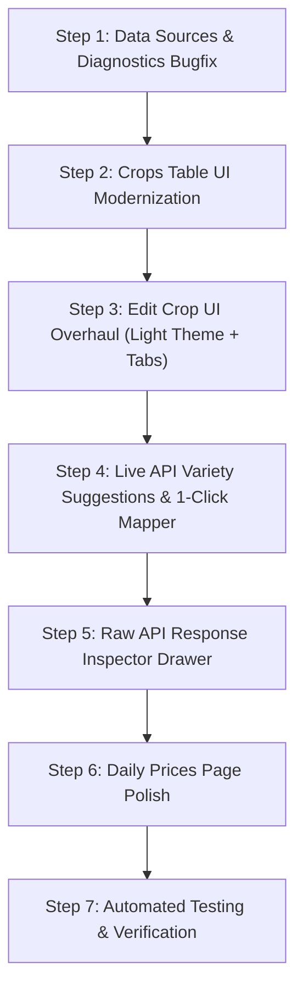

# Admin Panel UI Modernization, Live API Variety Suggestions & Inspector Plan

## 1. Overview & Objectives

This document outlines the architectural plan and implementation roadmap for comprehensive UI and workflow improvements in the **Krushi Baandhava Admin Panel**:
1. **Fix Data Sources Connection Diagnostics (`/admin/datasources`)**: Fix the fatal bug on TSS Sirsi and redesign the connection test diagnostic modal with robust error handling.
2. **Crops Directory Modernization (`/admin/crops`)**: Transform the crops table into a clean, deterministic, modern light-themed interface with streamlined columns.
3. **Edit Crop & Varieties UI Overhaul (`/admin/crops/{crop}/edit`)**: Modernize the crop edit interface into a clean tabbed layout (Profile, Discovery & Proximity, Varieties & API Mapping).
4. **Live API Variety String Suggestions & 1-Click Mapper**: Eliminate manual typing and guesswork by automatically extracting live variety strings from external feeds (CEDA, TSS Sirsi, Coffee Board, etc.) and identifying mapped vs unmapped varieties.
5. **Raw API Response Inspector**: Provide a dedicated interactive drawer/modal where admins can inspect the raw JSON/HTML response from any data source for a given crop.
6. **Daily Market Prices UI Polish (`/admin/prices`)**: Enhance filters, price spread indicators, source badges, and mobile responsiveness.

---

## 2. Architecture & Detailed Module Breakdown

### Module 1: Data Sources & Connection Diagnostic Fix
- **File**: `app/Services/DataSources/TssSirsi/TssSirsiDataProvider.php`
  - **Bug Fix**: In line 282, change `$res['status']` to `$res['http_status']` to resolve `Undefined array key "status"`.
- **File**: `app/Http/Controllers/Admin/DataSourceController.php`
  - Standardize `testConnection` to always return a structured JSON response `{ ok: bool, health: array }` with HTTP 200 so the frontend always has complete diagnostic data, even when external endpoints encounter errors or timeouts.
- **File**: `resources/views/admin/datasources/index.blade.php`
  - Overhaul the diagnostic modal:
    - **Header Status Badge**: `[ ✓ Online & Operational ]` (emerald), `[ ⚠️ Degraded ]` (amber), `[ ✕ Connection Failed ]` (rose).
    - **Metric Tiles**: HTTP Status (e.g. `200 OK`), Latency (e.g. `42 ms`), Auth Result (`Valid / Passed`), and Records Found (`20 Records`).
    - **Prominent Error Box**: Renders error messages with actionable remediation tips.
    - **Schema Inspector**: Neatly displays detected attributes as chips.
    - **Raw Payload Preview**: Syntax-highlighted sample record.
- **Local SSL Fallback**: In `BaseMarketDataProvider.php`, handle non-production environments gracefully so local Windows/XAMPP cURL can connect to HTTPS endpoints without cert-bundle errors.

---

### Module 2: Crops Directory Table Modernization (`/admin/crops`)
- **File**: `resources/views/admin/master/crops/index.blade.php`
  - **Theme Alignment**: Migrate from dark slate (`bg-slate-900`) to the uniform light stone/parchment theme (`bg-white border-stone-200/80 shadow-xs`) used throughout the rest of the application.
  - **Deterministic 7-Column Layout**:
    1. **Commodity**: 36px icon thumbnail + Crop English name + Kannada name + `★ Major` star badge.
    2. **Category & Unit**: Category pill (e.g. `Commercial & Plantation`) + Standard Unit (`Quintal`, `50kg Bag`, `Kg`).
    3. **Market Discovery**: Compact badge combining distance radius and default sort order (e.g. `[ 350 km • 📍 Nearest ]` or `[ All KA • 🔥 Top Rate ]`).
    4. **Data Feed & Active Prices**: Provider badge (`🏛️ CEDA / APMC`, `☕ Coffee Board`, `🌿 TSS Sirsi`) + live price count pill (`24 Active Prices`).
    5. **Varieties & Grades**: Pill tag indicating registered cultivars (e.g. `4 Grades`).
    6. **Status**: Quick toggle switch (`Active` vs `Paused`).
    7. **Actions**: Clean tooltip icon buttons (`[ ✏️ Edit ]`, `[ 👁️ View Live ]`).
  - **Refined Filter Bar**: Clean search input + category dropdown + instant reset button.

---

### Module 3: Edit Crop & Varieties UI Overhaul (`/admin/crops/{crop}/edit`)
- **File**: `resources/views/admin/master/crops/form.blade.php`
  - **Theme Alignment**: Migrate to light stone/white with emerald accents.
  - **Tabbed Structure**:
    - **Tab 1: Basic Profile & Agronomy**: Name, Kannada name, URL slug, Botanical name, Standard Unit, Category, Agronomy notes.
    - **Tab 2: Market Discovery & Proximity**: KM Range slider (25–500km with presets), Default Sort (Nearest vs Top Rate), Feature toggles.
    - **Tab 3: Varieties & API Feed Mapping**: Commercial varieties list, Live API Suggestions, and the 1-Click Alias Mapper.

---

### Module 4: Live API Variety String Suggestions & 1-Click Mapper
- **Backend Route & Controller Method**:
  - `GET /admin/crops/{crop}/live-varieties` in `app/Http/Controllers/Admin/CropController.php`.
  - Logic:
    1. Identifies the primary data sources associated with the crop.
    2. Fetches recent/live records or calls the provider.
    3. Extracts all distinct raw variety strings from the feed.
    4. Checks existing `crop_source_mappings` to determine whether each string is `mapped` (and to which `CropVariety`) or `unmapped`.
    5. Returns JSON response:
       ```json
       {
         "crop": "Arecanut",
         "source_name": "TSS Sirsi Cooperative",
         "varieties": [
           { "name": "Rashi", "price": 47000, "status": "mapped", "mapped_to": "Rashi", "mapping_id": 12 },
           { "name": "Bette", "price": 42500, "status": "mapped", "mapped_to": "Bette", "mapping_id": 13 },
           { "name": "Gorabal", "price": 38000, "status": "unmapped" },
           { "name": "Chali", "price": 41200, "status": "unmapped" }
         ]
       }
       ```
- **Frontend UI in Tab 3**:
  - Automatically loads these suggestions when Tab 3 is opened.
  - For unmapped items: Displays an instant dropdown **`[ Select Target Grade ▾ ]`** and **`[ + Map ]`** button.
  - Submitting sends an AJAX `POST` to create the mapping immediately without full page reload.

---

### Module 5: Raw API Response Inspector
- **Endpoint**:
  - `GET /admin/crops/{crop}/inspect-feed?data_source_id={id}`
  - Fetches the raw HTTP payload from the selected data source (or recent ingestion log).
- **UI Component**:
  - Slide-out side drawer or full modal opened via **`[ 🔍 Inspect Raw API Feed ]`**.
  - Shows:
    - Data source selector dropdown.
    - HTTP response code & latency badge (`200 OK • 38ms`).
    - Search / filter within the response records.
    - Formatted, syntax-highlighted JSON viewer with copy buttons for any attribute.

---

### Module 6: Daily Market Prices UI Polish (`/admin/prices`)
- **File**: `resources/views/admin/prices/index.blade.php`
  - Re-align filter grid into a clean, responsive layout.
  - Price column: Display Headline Modal Price in bold with an inline Min–Max spread bar (`₹42,000 - ₹50,000`) underneath.
  - Relative date badges (`Today`, `Yesterday`, `23 Sep`).
  - Distinguish source feeds with color-coded badges (`🏛️ APMC`, `☕ Coffee Board`, `🥥 Coconut Board`, `🌿 TSS Sirsi`).

---

## 3. Implementation Steps & Sequencing



| Step | Scope | Target Files |
| :--- | :--- | :--- |
| **Step 1** | Fix TSS Sirsi diagnostic bug, standardize controller response, redesign test connection modal. | `TssSirsiDataProvider.php`, `DataSourceController.php`, `admin/datasources/index.blade.php`, `BaseMarketDataProvider.php` |
| **Step 2** | Redesign `/admin/crops` table into deterministic light theme. | `resources/views/admin/master/crops/index.blade.php` |
| **Step 3** | Redesign `/admin/crops/{crop}/edit` into clean tabbed layout with light parchment theme. | `resources/views/admin/master/crops/form.blade.php` |
| **Step 4** | Build Live Variety Suggestion endpoint & 1-Click Mapper UI. | `CropController.php`, `routes/web.php`, `admin/master/crops/form.blade.php` |
| **Step 5** | Build Raw API Response Inspector modal/drawer. | `CropController.php`, `admin/master/crops/form.blade.php` |
| **Step 6** | Polish `/admin/prices` table, filters, spread bars, and source tags. | `resources/views/admin/prices/index.blade.php` |
| **Step 7** | Run PHPUnit tests and verify all features. | `tests/Feature/AdminCropVarietyMappingTest.php`, `tests/Feature/AdminDataSourceTest.php` |

---

## 4. Verification & Testing Criteria
1. **Data Sources Test Connection**:
   - Test all 5 data sources (`data_gov_mandi`, `ceda_agmarknet`, `tss_sirsi`, `coffee_board`, `coconut_board`).
   - Modal renders properly with 0 console errors and clear status badges.
2. **Crops Directory Table**:
   - Verify layout responsiveness, search, and category filter.
   - Verify all 7 columns align properly.
3. **Live API Variety Suggestions**:
   - When editing Arecanut, verify live feed variety strings (`Rashi`, `Bette`, `Gorabal`, etc.) are detected.
   - Map an unmapped string and verify it creates a record in `crop_source_mappings`.
4. **Raw API Inspector**:
   - Open drawer, verify raw JSON/HTML is retrieved and displayed with syntax formatting.
5. **Full Suite Pass**:
   - Run `vendor/bin/phpunit` to ensure all 200+ tests pass with zero regressions.
