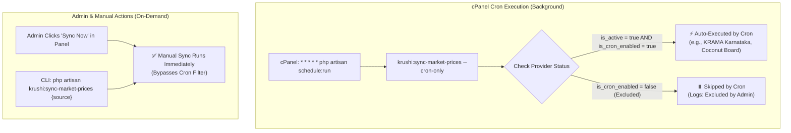

# Granular Cron Data Source Filtering & Scheduler Enhancement Plan

**Date:** 2026-10-03  
**Version:** 1.0  
**Target:** Admin Panel Data Source Management, cPanel Automated Scheduler & Console Commands  
**Status:** Implementation Ready  

---

## 1. Problem Statement & Motivation

In the Krushi Baandhava Admin Panel, administrators have access to the **"Automated Scheduling & cPanel Cron Assistant"** (`/admin/datasources`) and the **"Upstream Ingestion Feeds & API Status"** monitor (`/admin/dashboard`).

When the cPanel cron job (`php artisan schedule:run`) triggers the market price sync command (`krushi:sync-market-prices`) at scheduled times (06:00 Morning, 12:30 Mid-day, 19:30 Evening, hourly):
* **Current Behavior**: The command selects all data sources where `is_active = true`. Consequently, all 4 upstream services (KRAMA Karnataka, AGMARKNET Official, Coconut Development Board, Coffee Board) are automatically executed.
* **The Problem**: There is currently no mechanism to selectively include or exclude specific services from the automated background cron job.
  * Pausing a provider via `is_active = false` halts the provider entirely, preventing manual syncs, health checks, or test connections.
  * Certain providers (such as AGMARKNET Official with historical captcha verification, or heavy web scrapers) should only be run on demand or during specific maintenance windows, without running automatically on every scheduled cron tick.
  * The **"Set Cron Timings ⚙️"** drawer allows changing sync hours, but does not display or allow configuring *which* services participate in the automated schedule.

---

## 2. Core Architecture & Design Principles



### Key Design Principles:
1. **Decoupled States**: Global Operational Status (`is_active`) remains distinct from Background Automation Status (`is_cron_enabled`).
2. **Non-Destructive Manual Triggers**: Excluding a provider from automated cron execution does *not* disable manual one-click syncs, test connections, or crop mapping configuration.
3. **Dual Control Interfaces**:
   * **Centralized View**: Multi-select checklist inside the "Set Cron Timings" drawer in the Cron Assistant card.
   * **Quick Action View**: 1-click toggle badge directly in the Configured Providers table.
4. **Transparent Telemetry**: The Admin Dashboard and Ingestion Feeds table clearly display whether a service is running on automated cron or configured for manual execution.

---

## 3. Phased Implementation Plan

### Phase 1: Database Migration & Model Schema
* **Objective**: Add persistent storage for the cron inclusion flag.
* **Tasks**:
  1. Create database migration `add_is_cron_enabled_to_data_sources_table.php`:
     - Add `is_cron_enabled` (boolean, default: `true`, indexed) to `data_sources`.
  2. Update [`app/Models/DataSource.php`](file:///d:/xampp/htdocs/Krushi-Baandhava-application/app/Models/DataSource.php):
     - Add `is_cron_enabled` to `$fillable`.
     - Add `'is_cron_enabled' => 'boolean'` to `casts()`.
     - Add Eloquent scopes:
       - `scopeCronEnabled(Builder $query)`: Filters where `is_active = true` AND `is_cron_enabled = true`.
       - `scopeCronExcluded(Builder $query)`: Filters where `is_cron_enabled = false`.

---

### Phase 2: Console Command & Scheduler Logic
* **Objective**: Ensure the automated scheduler strictly respects the `is_cron_enabled` flag while preserving manual execution overrides.
* **Tasks**:
  1. Update [`app/Console/Commands/SyncMarketPricesCommand.php`](file:///d:/xampp/htdocs/Krushi-Baandhava-application/app/Console/Commands/SyncMarketPricesCommand.php):
     - Add `--cron-only` option to the command signature:
       ```php
       protected $signature = 'krushi:sync-market-prices
                               {source? : Code of the specific data source}
                               {--date= : Specific target date (YYYY-MM-DD)}
                               {--force : Force sync even if raw payload checksum already exists}
                               {--dry-run : Ingest and validate without upserting}
                               {--cron-only : Only process sources enrolled in automated cron}';
       ```
     - In `handle()`, modify query resolution:
       ```php
       if ($sourceCode) {
           $query->where('code', $sourceCode);
       } elseif ($this->option('cron-only') || !$isForced) {
           $query->where('is_active', true)->where('is_cron_enabled', true);
       } else {
           $query->where('is_active', true);
       }
       ```
     - Output informational skips for excluded providers:
       `"↷ Skipping [Provider Name]: Excluded from automated background cron schedule by admin."`
  2. Update [`routes/console.php`](file:///d:/xampp/htdocs/Krushi-Baandhava-application/routes/console.php):
     - Ensure scheduled morning, mid-day, evening, hourly, and 15-minute sync invocations execute with `--cron-only`:
       ```php
       Schedule::command('krushi:sync-market-prices --cron-only')
           ->dailyAt($morningTime)
           ->withoutOverlapping(60)
           ->runInBackground();
       ```

---

### Phase 3: Admin Controller & Route Handlers
* **Objective**: Provide secure endpoints for toggling cron enrollment and updating schedule source assignments.
* **Tasks**:
  1. Add route in `routes/web.php` (under `admin.datasources` prefix):
     - `POST /admin/datasources/{datasource}/toggle-cron` &rarr; `DataSourceController@toggleCron`
  2. Update [`app/Http/Controllers/Admin/DataSourceController.php`](file:///d:/xampp/htdocs/Krushi-Baandhava-application/app/Http/Controllers/Admin/DataSourceController.php):
     - Implement `toggleCron(DataSource $datasource)`:
       - Toggle `$datasource->is_cron_enabled`.
       - Write audit log entry (`AuditLog::log('toggle_cron', 'DataSource', ...)`).
       - Return JSON response for AJAX calls or redirect back with flash message.
     - Update `updateScheduleTimings(Request $request)`:
       - Validate optional `cron_source_ids` (array of data source IDs).
       - When provided, update all active data sources:
         - Set `is_cron_enabled = true` for IDs in array.
         - Set `is_cron_enabled = false` for IDs not in array.
       - Write updated state to Audit Log.

---

### Phase 4: Admin UI Enhancements in Data Sources Management
* **File:** [`resources/views/admin/datasources/index.blade.php`](file:///d:/xampp/htdocs/Krushi-Baandhava-application/resources/views/admin/datasources/index.blade.php)
* **Tasks**:
  1. **Automated Scheduling Card Summary**:
     - Add a live scope summary indicator next to configured timings:
       ```html
       <span class="px-2.5 py-0.5 rounded-lg bg-indigo-950 text-indigo-300 border border-indigo-800 font-bold">
           ⚡ Cron Scope: {{ $stats['cron_enabled_count'] }} of {{ $stats['total'] }} Feeds Enrolled
       </span>
       ```
  2. **Interactive Schedule Timings Drawer**:
     - Inside the "Set Cron Timings ⚙️" drawer, add a section:
       **"Eligible Feeds for Automated Background Cron"**
     - Display a grid of cards with checkboxes for each provider:
       - Provider Name & Code
       - Adapter type & Primary badge
       - Current status (Active / Paused)
       - Checkbox to include/exclude in automated runs
  3. **Configured Providers Table**:
     - Add a dedicated **"Cron Schedule"** column (or interactive badge in Status column):
       - If enrolled: `<button class="bg-emerald-950 text-emerald-300 border border-emerald-800">⚡ Auto Cron Enabled</button>`
       - If excluded: `<button class="bg-amber-950/80 text-amber-300 border border-amber-800">⏸️ Excluded (Manual Only)</button>`
     - Wire 1-click AJAX toggle handler to update status instantly without full-page reload.

---

### Phase 5: Admin Dashboard Visibility
* **File:** [`resources/views/admin/dashboard.blade.php`](file:///d:/xampp/htdocs/Krushi-Baandhava-application/resources/views/admin/dashboard.blade.php)
* **Tasks**:
  1. In the **"Upstream Ingestion Feeds & API Status"** table:
     - Add a **Cron Automation** badge column or tag:
       - `⚡ Auto-Scheduled`: Shows that cPanel cron executes this feed automatically.
       - `⏸️ Manual / On-Demand`: Shows that this feed is excluded from automatic cron execution and only runs manually.

---

### Phase 6: Automated Testing & Verification
* **Tasks**:
  1. Unit & Feature Tests:
     - `test_cron_command_respects_is_cron_enabled_flag()`: Verify that `krushi:sync-market-prices --cron-only` executes enrolled sources and skips excluded sources.
     - `test_manual_sync_runs_even_if_cron_excluded()`: Verify that passing `{source}` or `--force` executes an excluded source.
     - `test_admin_can_toggle_cron_status_via_api()`: Verify authorization and state mutation for `toggleCron`.
     - `test_bulk_schedule_timing_updates_enrolled_sources()`: Verify form submission from timing drawer properly updates multiple sources.
  2. End-to-End Verification:
     - Verify UI rendering in browser across desktop and mobile screens.
     - Run `php artisan krushi:sync-market-prices --cron-only --dry-run` and verify console output.

---

## 4. Rollout Strategy & Fallback Safety

* **Default Value**: `is_cron_enabled` defaults to `true` during migration, ensuring existing operational behavior is preserved until explicitly customized by the administrator.
* **Fail-Safe**: If all sources are unchecked, the cron command logs a warning and exits gracefully (`self::SUCCESS`) without throwing errors.
* **Zero Disruption to Farmer APIs**: Changes are strictly confined to administrative ingestion orchestration; farmer endpoints, price discovery, and caching are unaffected.
