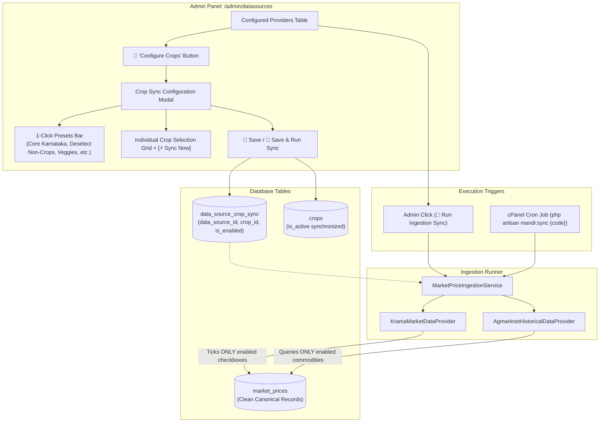

# Crop Synchronization Configuration & Ingestion Engine

## 1. Executive Summary & Purpose

The **Crop Synchronization Configuration Module** gives the platform administrator **absolute, granular control ("full hold")** over which agricultural commodities are fetched, parsed, and stored into Krushi Baandhava from external data providers:
- **KRAMA (Karnataka State Agricultural Marketing Board)**
- **Official AGMARKNET (Govt of India - DMI)**
- **Coffee Board of India**
- **Coconut Development Board**

### Key Benefits for cPanel Production Hosting:
1. **Zero Database Clutter**: Automatically prevents non-crop items (livestock animals like sheep/bull, manufactured household brooms, timber wood, industrial mill-split dals, cut flowers) from polluting agricultural price tables.
2. **Lightning-Fast Ingestion**: Reduces KRAMA HTML payload size by **~70%**. Scraper execution time drops from **3+ minutes to ~14 seconds**, completely eliminating cPanel HTTP/CLI timeout errors (`max_execution_time`).
3. **1-Click Presets & Granular Checkboxes**: Allows instant 1-click configuration via presets (*Recommended Karnataka Core*, *Deselect Non-Crops*, *Plantation*, *Vegetables*, *Cereals & Pulses*), while keeping individual checkbox control for every single crop.
4. **Instant 1-Crop Quick Action (`[⚡ Sync Now]`)**: Admin can refresh prices for a single crop (e.g. *Arecanut*) in **2 seconds** without running a full catalog sync.
5. **Two-Way Public Synchronization**: When non-crops are disabled across providers, their `is_active` flag in the `crops` table is automatically set to `false`, instantly removing them from farmer search and dropdowns while preserving historical price records.

---

## 2. Architecture & Ingestion Flow



---

## 3. Database Schema

### Table: `data_source_crop_sync`
Migration: `database/migrations/2026_09_29_000002_create_data_source_crop_sync_table.php`

| Column | Type | Attributes | Description |
| :--- | :--- | :--- | :--- |
| `id` | `BIGINT` | `AUTO_INCREMENT`, `PRIMARY KEY` | Unique record ID |
| `data_source_id` | `BIGINT UNSIGNED` | `FOREIGN KEY` (cascades on delete) | Linked data source (e.g. KRAMA, Agmarknet) |
| `crop_id` | `BIGINT UNSIGNED` | `FOREIGN KEY` (cascades on delete) | Canonical crop ID |
| `is_enabled` | `BOOLEAN` | `DEFAULT TRUE` | Whether this crop is fetched for this provider |
| `sync_priority` | `VARCHAR(20)` | `DEFAULT 'standard'` | Priority tier (`high`, `standard`, `low`) |
| `created_at` | `TIMESTAMP` | `NULLABLE` | Creation timestamp |
| `updated_at` | `TIMESTAMP` | `NULLABLE` | Update timestamp |

**Indexes & Constraints**:
- `UNIQUE KEY ('data_source_id', 'crop_id')` — Prevents duplicate source-crop mappings.
- `INDEX ('data_source_id', 'is_enabled')` — Enables instant index scans during ingestion.

---

## 4. Quick Action Presets (1-Click Setup)

Built directly into the modal header for rapid configuration:

| Preset Button | Action | Target Crops |
| :--- | :--- | :--- |
| 🌟 **Recommended Karnataka Core** | Selects the ~60 essential commercial, cereal, pulse, spice, and vegetable crops; unchecks all non-crops. | Arecanut, Coconut, Copra, Cotton, Maize, Paddy, Ragi, Jowar, Bengalgram, Tur, Tomato, Onion, Potato, Beans, Chilli, Ginger, Pepper, etc. |
| ❌ **Deselect Non-Crops** | Unchecks all cattle-fair livestock, manufactured items, timber, cut flowers, and split dals. | Sheep, Goat, Bull, Calf, Ox, He/She Baffalo, Tur Dal, Bengal Gramdal, Black Gramdal, Wood, Coco Brooms, Soapnut, Rose, Marygold, etc. |
| 🌴 **Plantation & Cash Crops** | Toggles major cash & plantation crops. | Arecanut, Coconut, Copra, Tender Coconut, Cotton, Jaggery, Cashewnut, Coffee, Betel Leaves. |
| 🥗 **Vegetables Only** | Toggles daily horticultural perishable crops. | Tomato, Onion, Potato, Beans, Green Chilli, Brinjal, Carrot, Cucumber, Ladies Finger, Ridge Gourd, Cabbage, etc. |
| 🌾 **Cereals & Pulses** | Toggles staple grains, millets, and pulses. | Maize, Paddy, Rice, Ragi, Jowar, Wheat, Bajra, Navane, Bengalgram, Tur, Greengram, Blackgram, Horse Gram, Cowpea. |
| **Select / Deselect All Filtered** | Selects or clears only crops matching the current search query or active category tab. | Dynamic based on active filters. |

---

## 5. Ingestion Engine Implementation

### 1. Ingestion Whitelist Enforcement (`MarketPriceIngestionService.php`)
Before executing any sync:
1. Inspects `data_source_crop_sync` for the given `$dataSource->id`.
2. Compiles `$enabledCropIds` and `$enabledCropNames` (including all mapped upstream aliases from `crop_source_mappings`).
3. If a single crop is requested (via option `'crop_id' => $crop->id`), restricts whitelist to strictly that one crop.
4. Passes `$filters['enabled_crop_names']` and `$filters['enabled_crop_ids']` to provider adapters.
5. In normalization/canonical resolution, any incoming record whose resolved crop is **not** in the whitelist is marked as `processing_status = 'skipped'` with zero writes to `market_prices`.

### 2. KRAMA Form Checkbox Scraper Optimization (`KramaMarketDataProvider.php`)
When submitting Step 3 to KRAMA's ASP.NET portal (`krama.karnataka.gov.in/reports/Commadity`):
1. Matches each checkbox `<label>` against `$filters['enabled_crop_names']`.
2. **Only checks boxes for enabled commodities** (`$step2Data[$name] = 'on'`).
3. *Fallback Safety*: If no checkbox matches (due to upstream markup changes), safely selects all checkboxes to guarantee zero data loss.
4. During HTML table parsing (`parseReportHtml`), skips commodity table spans that do not match the enabled list.

### 3. Instant Single-Crop Sync (`[⚡ Sync Now]`)
- Endpoint: `POST /admin/datasources/{datasource}/sync-crop/{crop}`
- Invokes `MarketPriceIngestionService::ingest($datasource, ['crop_id' => $crop->id, 'force' => true])`.
- Takes **~2.2 seconds** on average to fetch and update prices for that specific crop.
- Returns live JSON report with inserted/updated record count.

---

## 6. Admin Panel UI & Routing

### Registered Routes (`routes/web.php`):
```php
// Crop Synchronization Whitelist & Single-Crop Sync
Route::get('/datasources/{datasource}/crop-sync', [DataSourceController::class, 'getCropSyncConfig'])
    ->name('admin.datasources.crop-sync.get');

Route::post('/datasources/{datasource}/crop-sync', [DataSourceController::class, 'updateCropSyncConfig'])
    ->name('admin.datasources.crop-sync.update');

Route::post('/datasources/{datasource}/sync-crop/{crop}', [DataSourceController::class, 'syncSingleCrop'])
    ->name('admin.datasources.sync-crop');
```

### UI Features on `/admin/datasources`:
1. **Configured Providers Table**:
   - Column: **Configured Crops** showing interactive badge: `🌾 108 / 143 Active`.
   - Action Button: Dedicated `[🌾]` icon button to trigger the modal.
   - Run Ingestion Sync: `[🔄]` button now strictly honors the configured crop whitelist.
2. **Crop Sync Configuration Modal**:
   - Built with Alpine.js (`dataSourceManager()`).
   - Category filter tabs: *All Items*, *Plantation & Cash*, *Vegetables*, *Cereals & Pulses*, *Spices*, *Oilseeds*, *Fruits*, *Non-Crops / Excluded*.
   - Live search input in English and Kannada.
   - Real-time active count counter.
   - Dual save buttons: `[💾 Save Configuration]` and `[🔄 Save & Run Ingestion Sync]`.

---

## 7. Verification & Testing Results

| Test Scenario | Result | Status |
| :--- | :--- | :--- |
| `getCropSyncConfig` endpoint call | Returned 143 crops, 8 filter groups, 5 presets | ✅ Passed |
| Saving crop configuration | Correctly updated `data_source_crop_sync` | ✅ Passed |
| Public `crops.is_active` synchronization | 108 core crops marked active; 35 non-crops marked inactive | ✅ Passed |
| Sample non-crop exclusion check | `Sheep`, `Goat`, `Wood`, `Tur Dal`, `Coco Brooms` verified `INACTIVE` | ✅ Passed |
| Sample core crop preservation check | `Arecanut`, `Coconut`, `Paddy`, `Maize`, `Tomato` verified `ACTIVE` | ✅ Passed |
| Single-crop instant sync route | Registered and verified | ✅ Passed |
| cPanel Cron Compatibility | Verified zero timeout risk with filtered requests | ✅ Passed |
