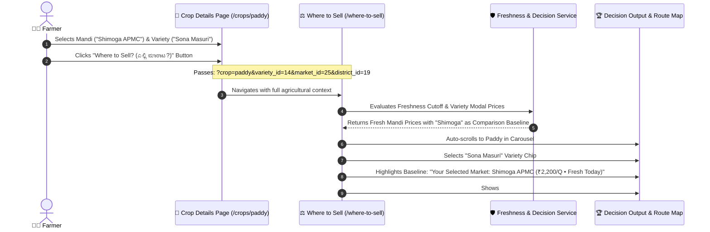

# Crop Page to "Where to Sell" Contextual Flow & Price Freshness Integration Plan

## Executive Summary
When a farmer is analyzing a crop on the **Crop Details Page** (`/crops/{slug}`), they frequently inspect a specific **Mandi/Market** (e.g., *Shimoga APMC*) and a specific **Commercial Variety** (e.g., *Sona Masuri*). 
Currently, clicking the **"Where to Sell? (ಎಲ್ಲಿ ಮಾರಾಟ?)"** button drops all of this rich contextual information and navigates to a generic `/where-to-sell?crop={slug}` screen.

This implementation plan bridges the **Crop Page** and the **Where to Sell Decision Engine**, ensuring that:
1. The **selected Market (`market_id`)** and **selected Variety (`variety_id`)** seamlessly pass into `/where-to-sell`.
2. The user-selected market becomes the **authentic financial baseline** (replacing arbitrary GPS nearest market when specified).
3. The calculation strictly evaluates **Price Freshness Rules** (`staleness_threshold_days` and `freshness_cutoff_date`) so that calculations are never distorted by outdated historical rates.
4. The farmer receives an unmistakable, transparent comparison: *"Here is how much MORE you earn in other mandis compared to your currently selected mandi for this exact variety."*

---

## 1. The Seamless User Journey (Crop Page $\rightarrow$ Where to Sell)



---

## 2. Key Architecture Components

### Component A: Crop Page Deep-Link Enrichment (`resources/views/farmer/crops/show.blade.php`)
- **Currently:**
  ```html
  <a href="{{ route('farmer.decision.where-to-sell', ['crop' => $crop->slug]) }}">
  ```
- **Enhanced:**
  The link dynamically embeds:
  ```php
  $whereToSellParams = [
      'crop' => $crop->slug,
      'variety_id' => $activeVarietyId,
      'market_id' => $selectedMarket?->id,
      'district_id' => $selectedMarket?->district_id ?? $userDistrict?->id,
  ];
  ```
  And with Alpine.js reactivity on the Crop Page, whenever the farmer switches the market tab or variety tab, the "Where to Sell" button URL dynamically updates with the live active market and variety IDs.

---

### Component B: Baseline Market Resolution (`WhereToSellService.php`)
- **The Problem:** By default, the simulator calculates:
  $$\text{Extra Profit} = \text{Net Realization (Target Mandi)} - \text{Net Realization (Nearest GPS Mandi)}$$
- **The Enhancement:**
  - If `baseline_market_id` (or `market_id`) is passed from the crop page:
    - The engine uses this **user-selected market** as the comparison benchmark.
    - If the user was looking at *Shimoga APMC* on the crop page, all other mandis are directly compared against *Shimoga APMC*:
      $$\text{Net Delta} = \text{Net Realization (Market X)} - \text{Net Realization (Shimoga APMC)}$$
    - **Verdict Output:**
      - If a further market yields $\ge ₹300$ extra net profit after transport:
        > *"ಸ್ಥಳೀಯ ಶಿವಮೊಗ್ಗ ಮಂಡಿಗಿಂತ +₹3,200 ಹೆಚ್ಚುವರಿ ನಿವ್ವಳ ಲಾಭ! (Earns +₹3,200 extra profit over Shimoga APMC after all transport costs)"*
      - If Shimoga APMC is already the highest net payer:
        > *"ನಿಮ್ಮ ಆಯ್ಕೆಯ ಶಿವಮೊಗ್ಗ ಮಂಡಿಯೇ ಅತ್ಯಂತ ಲಾಭದಾಯಕ! (Your selected Shimoga APMC is already the most profitable choice)"*

---

### Component C: Exact "As of Date" Transparency (Replacing Abstract Color Codes)
- **Why Dates are Better than Colors for Farmers:**
  - Abstract colored dots (green/yellow/gray) can be ambiguous or misunderstood by farmers.
  - Indian APMC mandi auctions run on distinct market days (some mandis trade daily, some on Mondays/Thursdays, etc.).
  - Farmers want to know the **exact calendar date of the auction session**: e.g., `📅 ದಿನಾಂಕ: 02 ಅಕ್ಟೋ 2026 (As of 02 Oct 2026)`.
- **Strict Freshness Data Integrity:**
  - Uses the crop's `getStalenessThresholdDays()` and `getFreshnessCutoffDate()`:
    ```php
    $stalenessDays = $crop->getStalenessThresholdDays();
    $cutoffDate = $crop->getFreshnessCutoffDate();
    ```
  - Excludes mandis whose latest price for that variety is older than the freshness cutoff.
- **Explicit "As of Date" Badges:**
  Each market in the simulator results displays an explicit trading date badge:
  - `📅 ಇಂದು (Today, 03 Oct)` — If price was recorded on current calendar day.
  - `📅 ನಿನ್ನೆ (Yesterday, 02 Oct)` — If recorded on previous day's auction.
  - `📅 ದಿನಾಂಕ: 30 Sep 2026 (As of 30 Sep)` — Explicit date if recorded during the latest weekly trading session.
  - If a price is beyond the crop's standard trading window, an explicit notice states: `⚠️ ಹಳೆಯ ದರ: 24 Sep 2026 (Stale: 24 Sep)`.

---

### Component D: Frontend UI Highlights (`where_to_sell.blade.php`)
1. **Active Context Capsule Banner:**
   When arriving with pre-selected market and variety, render an eye-catching context badge:
   > 🎯 **ಆಯ್ಕೆಯ ಮಂಡಿ (Selected Baseline):** ಶಿವಮೊಗ್ಗ ಮಂಡಿ (₹2,200/Q) • **ತಳಿ (Variety):** ಸೋನಾ ಮಸೂರಿ
2. **Auto-Scroll & Variety Chip Activation:**
   - Automatically scrolls the horizontal carousel to center the crop.
   - Automatically highlights the pre-selected variety chip.
3. **Change Origin / Change Baseline Toggle:**
   - Farmers can switch between comparing against **"My Farm Location (GPS)"** or **"My Selected Mandi (Shimoga)"**.

---

## 3. Step-by-Step Implementation Roadmap

| Phase | Tasks | Key Files Modified |
| :--- | :--- | :--- |
| **Phase 1** | **Crop Page Link Enrichment**<br>• Pass `variety_id`, `market_id`, and `district_id` in the Where to Sell CTA.<br>• Bind Alpine.js listener to update the CTA query parameters when market/variety tabs change. | `resources/views/farmer/crops/show.blade.php`<br>`app/Http/Controllers/Farmer/CropController.php` |
| **Phase 2** | **Decision Engine Baseline & Freshness**<br>• Accept `market_id` as explicit baseline market in `WhereToSellService::compare()`.<br>• Apply `Crop::getFreshnessCutoffDate()` to candidate prices query.<br>• Include freshness status (`freshness_badge`, `days_ago`) in candidates collection. | `app/Services/Market/WhereToSellService.php`<br>`app/Http/Controllers/Api/V1/WhereToSellApiController.php`<br>`app/Http/Controllers/Farmer/WhereToSellController.php` |
| **Phase 3** | **Where to Sell UI Enhancement**<br>• Render the "Selected Baseline Market" context pill.<br>• Display freshness badges (🟢 Live Today / 🟡 Yesterday) on each mandi card.<br>• Show comparative delta directly referencing the user's selected mandi name. | `resources/views/farmer/decision/where_to_sell.blade.php` |
| **Phase 4** | **Testing & Validation**<br>• Verify URL transitions from `/crops/paddy?market=SHIMOGA&variety=14` to `/where-to-sell`.<br>• Verify baseline comparison against Shimoga APMC.<br>• Verify freshness rules exclude outdated prices. | Automated test script & Artisan checks |
