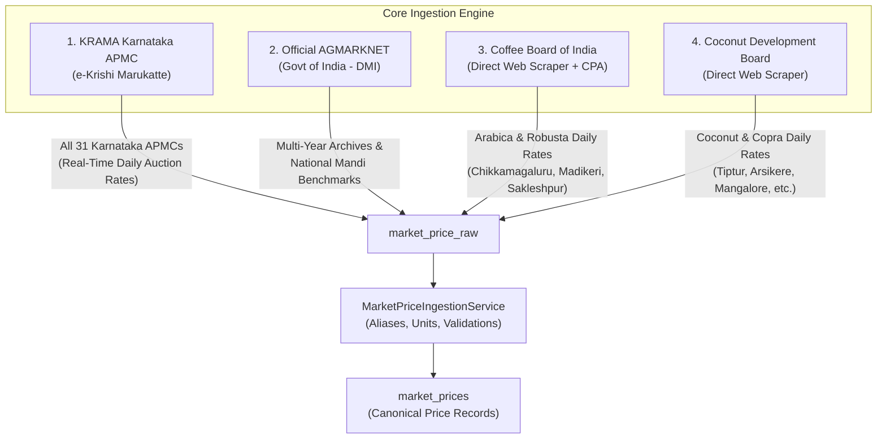

# Krushi Baandhava — Finalized 4-Core Data Source Architecture & Cleanup Specification

**Date:** 2026-09-29  
**Version:** 2.0 (Post-Cleanup)  
**Status:** Approved & Implemented  

---

## 1. Executive Summary

Krushi Baandhava originally integrated multiple experimental and open-data feeds. Over time, official specialized feeds were built directly for each commodity domain. 

To ensure maximum data fidelity, zero scraping points of failure, fast execution, and lean database storage on cPanel hosting, the data ingestion architecture has been consolidated into **strictly 4 official core providers**. All experimental and redundant adapters (**TSS Sirsi Cooperative Society**, **data.gov.in Mandi Prices**, and legacy **CEDA Agmarknet**) have been decommissioned.

---

## 2. The 4 Finalized Core Providers



### Detailed Breakdown of the 4 Core Sources:

| # | Provider Code | Source Name | Role & Responsibility | Update Frequency |
|---|---|---|---|---|
| 1 | `krama_karnataka` | **KRAMA (Karnataka State Agricultural Marketing Board)** | **Primary Daily Live Price Source**: Captures daily auction tender transactions across all Karnataka APMC markets (including Sirsi, Shivamogga, Sagar, Kolar, Bangalore, Hubballi, etc.). | Opening (06:00), Evening (18:00), and Hourly (10:00–17:00 IST) |
| 2 | `agmarknet_official` | **Official AGMARKNET (Govt of India - DMI)** | **National & Historical Benchmark**: Official multi-year archive and fallback feed for historical seasonal price index modeling. | Opening (06:00) & Nightly (01:00 IST) |
| 3 | `coffee_board` | **Coffee Board of India** | **Direct Official Scraper**: Extracts daily raw coffee price tables directly from the Coffee Board of India (`coffeeboard.gov.in`) with automated session & ASP.NET ViewState handling, with fallback to CPA API. | Daily (Opening & Mid-day) |
| 4 | `coconut_board` | **Coconut Development Board** | **Direct Official Scraper**: Scrapes daily market rates from CDB (`coconutboard.gov.in`) for dry coconut (copra), dehusked coconut, and tender coconut. | Daily (Opening & Mid-day) |

---

## 3. Rationale for Retiring Redundant Providers

### 1. TSS Sirsi Cooperative Society (`tss_sirsi`) — RETIRED
* **Why it was removed:** The Totgars' Cooperative Sale Society Ltd. (TSS Sirsi) conducts daily tenders inside the Sirsi APMC yard. These exact tender transactions are officially submitted to Karnataka's e-tender system and ingested automatically by **KRAMA** under market `SIRSI`.
* **Impact on Sirsi APMC:** **Zero**. The market yard `Sirsi APMC (TSS)` in the `markets` table remains completely active. KRAMA maps `SIRSI` to this market and populates all arecanut varieties (*Rashi, Chali, Bette, Kempugotu, Bilegotu*).

### 2. data.gov.in Mandi Prices (`data_gov_mandi`) — RETIRED
* **Why it was removed:** data.gov.in is an asynchronous open-data mirror that often lags behind Agmarknet by days, enforces strict rate-limits, and frequently experiences 502 Bad Gateway timeouts.
* **Replacement:** Direct query to **Official Agmarknet (`api.agmarknet.gov.in`)** and **KRAMA** provides 100% reliable, real-time data without third-party API keys or rate-limits.

### 3. CEDA Agmarknet (`ceda_agmarknet`) — RETIRED
* **Why it was removed:** Ashoka University's CEDA API was a legacy intermediary API that has been fully superseded by direct government ingestion.

---

## 4. Safety & Data Integrity Audit

Before decommissioning, an exhaustive foreign-key and record audit was conducted:

1. **Canonical `market_prices` Table**:
   * `data_gov_mandi`: **0 records**
   * `tss_sirsi`: **0 records**
   * **Result:** No live prices were stored under these sources; **zero canonical price records lost**.
2. **Foreign Key Deletion Order**:
   * Any child tables referencing `data_sources.id` (`market_price_raw`, `crop_source_mappings`, `market_source_mappings`, `data_source_mappings`, `data_source_credentials`, `sync_logs`, `api_health_logs`) are pruned via database migration in proper cascade order.
3. **Reproducibility on cPanel**:
   * The cleanup is encapsulated in a dedicated Laravel migration (`database/migrations/2026_09_29_000001_retire_unused_data_sources.php`), ensuring that running `php artisan migrate` on any production or cPanel environment executes the cleanup safely and cleanly.

---

## 5. cPanel Automated Scheduler Architecture

The single cron job configured in cPanel:
```bash
* * * * * cd /home/username/public_html && php artisan schedule:run >> /dev/null 2>&1
```

Triggers all automated background jobs according to the dynamic schedule:

| Job Command | Scheduled IST Time | Functionality |
|---|---|---|
| `Schedule::call(...)` | Every Minute | Updates `scheduler_last_heartbeat` for the Admin Panel live health monitor |
| `krushi:sync-market-prices` | 06:00 IST Daily | Morning Mandi Opening Arrivals & Bids Sync |
| `krushi:sync-market-prices` | 18:00 IST Daily | Evening Final Closing Auction Rates Sync |
| `krushi:sync-market-prices` | Hourly (10:00–17:00 IST) | Intraday trading hours refresh |
| `krushi:sync-weather` | 05:30 & 14:30 IST | Hyperlocal 7-Day agricultural weather advisories (Open-Meteo) |
| `krushi:compute-statistics --months` | 01:00 IST Nightly | Computes 12-month historical seasonal price index |
| `krushi:generate-forecasts` | 02:00 IST Nightly | Generates 1D, 7D, 15D, 30D Holt's Linear AI projections |
| `krushi:prune-prices --days=365` | 23:00 IST Nightly | Automated rolling 1-year retention cleanup (keeps database lean at ~35 MB) |
