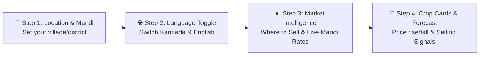

# Krushi Baandhava — "How to Use" (ಹೇಗೆ ಬಳಸುವುದು) Interactive Onboarding Tour Implementation Plan

## Executive Summary
This document specifies the end-to-end architecture and implementation plan for the interactive **"How to Use" (ಹೇಗೆ ಬಳಸುವುದು)** guided walkthrough on the Krushi Baandhava platform. Modeled after the benchmark experience on Negilu Krishi, this feature provides first-time and returning farmers with an interactive, animated visual spotlight tour featuring native bilingual copy (Kannada + English) and voice audio narration.

---

## Technical Specifications & Architecture

### 1. Triggering & Persistence Logic
* **First-Time Visitors**:
  * Detects absence of cookie `krushi_tour_done=1`.
  * Only triggers automatically on the homepage (`/` or `route('home')`).
  * Waits **1.4 seconds** after initial page load (letting price feeds, hero fonts, and layout settle) before initiating the first step.
* **Manual Replay & Triggers**:
  * Persistent 💡 **ಹೇಗೆ ಬಳಸುವುದು (How to Use)** action button on the homepage hero banner calling `window.startKrushiTour()`.
  * URL override parameter `?tour=1` allowing instant tour launch for testing or support links.
* **Dismissal & Cookie Expiry**:
  * Tapping **"ಬಿಟ್ಟುಬಿಡಿ" (Skip)**, **"ಮುಗಿಯಿತು" (Done)**, or tapping anywhere on the dark backdrop terminates the tour.
  * Sets cookie: `krushi_tour_done=1; max-age=31536000; path=/; SameSite=Lax` (1 year).

---

### 2. The 4 Core Tour Steps (Desktop & Mobile Adaptive)

| Step # | Target Element | Kannada Title & Copy | English Translation |
| :--- | :--- | :--- | :--- |
| **Step 1** | `#tourHeroLocationCard` or `#tourHeaderLocationPill` | 📍 **ಮೊದಲು ಈ ಬಟನ್ ಒತ್ತಿ ನಿಮ್ಮ ಊರು/ಜಿಲ್ಲೆ ಆಯ್ಕೆ ಮಾಡಿ — ಹತ್ತಿರದ ಮಾರುಕಟ್ಟೆ ದರ ಸಿಗುತ್ತದೆ.** | *First tap this button to set your village or district — you will get accurate prices for mandis near you.* |
| **Step 2** | `#tourLangToggle` | 🌐 **ಕನ್ನಡ ಅಥವಾ English — ಇಲ್ಲಿ ಸುಲಭವಾಗಿ ಭಾಷೆ ಬದಲಿಸಿ.** | *Switch easily between Kannada and English anytime right here.* |
| **Step 3** | `#tourWhereToSellCard` / `#tourPricesSection` | 📊 **ಇಂದಿನ ಅಧಿಕೃತ ಮಂಡಿ ದರಗಳು ಮತ್ತು 'ಎಲ್ಲಿ ಮಾರಾಟ ಮಾಡಬೇಕು' ಎಂಬ ಮಾರ್ಗದರ್ಶನ ಇಲ್ಲಿದೆ.** | *View today's official APMC mandi rates and 'Where to Sell' market comparison guides here.* |
| **Step 4** | `#tourCropCard` / `.crop-card-first` | 🌾 **ಯಾವುದೇ ಬೆಳೆ ಒತ್ತಿ — ದರ ಏರುತ್ತದೋ ಇಳಿಯುತ್ತದೋ, ಯಾವಾಗ ಮಾರಬೇಕು ಎಂಬ ಮುನ್ಸೂಚನೆ ತಿಳಿಯಿರಿ.** | *Tap any crop card to see live prices, AI rate forecast (rising or falling), and optimal selling advice.* |
| **Step 5 (Mobile Only)** | `#mobileBottomNav` | 📱 **ದರಗಳು, ಸರ್ಕಾರಿ ಯೋಜನೆಗಳು, ಹವಾಮಾನ ಮತ್ತು ವಿಡಿಯೋಗಳು — ಕೆಳಗಿನ ಮೆನುವಿನಲ್ಲಿ ಲಭ್ಯ.** | *Mandi rates, government welfare schemes, weather alerts, and videos are available here.* |

---

### 3. Voice & Audio Narration Engine

* **Pre-Recorded Native Kannada Audio Files**:
  * Hosted at `public/audio/tour/step{1..4}.mp3`.
  * High-clarity native Kannada voice narration explaining each step in a friendly, conversational tone for rural farmers.
* **Hybrid Fallback (Web Speech API)**:
  * When in English mode or if local audio playback is interrupted, invokes `window.speechSynthesis` with Indian English (`en-IN`) or native device voices.
* **Speaker Controls**:
  * Interactive 🔊 button on the popover bubble allows farmers to replay the audio narration on demand.
  * Mute/unmute state persists for the session.

---

### 4. UI Design & Spotlight Cutout System

* **Giant Box-Shadow Cutout (`.kb-tour-hole`)**:
  * Avoids heavy canvas or SVG masks.
  * Uses `box-shadow: 0 0 0 9999px rgba(15, 30, 20, 0.65)` around the target's bounding box.
  * Smooth transition: `transition: all 0.28s cubic-bezier(0.16, 1, 0.3, 1)`.
  * Padding: 8px visual clearance around highlighted buttons/cards.
* **Floating Popover Card (`.kb-tour-bubble`)**:
  * Crisp card styled with Forest Green (`#1C5A2C`), warm cream background, and elevated shadow (`box-shadow: 0 16px 40px rgba(0,0,0,0.32)`).
  * Bold primary Kannada typography (`font-kannada font-extrabold`) + gentle English secondary subtitle.
  * Navigation Controls:
    * `🔊` Audio replay button
    * `1/4` Step counter
    * `ಬಿಟ್ಟುಬಿಡಿ` / `Skip` text button
    * `ಹಿಂದೆ` / `Back` button
    * `ಮುಂದೆ` / `Next` solid green pill button

---

## Phase-Wise Execution Plan

### Phase 1: Guided Tour Blade Component (`components/onboarding-tour.blade.php`)
1. Create the complete standalone component containing:
   - Full-screen transparent backdrop click catcher
   - Animated spotlight hole
   - Dynamic floating popover bubble
   - Settle loop using `requestAnimationFrame` to ensure zero jitter during font/image rendering
   - Step navigation controller (Next, Back, Skip, Done)
   - Audio controller with auto-play and manual 🔊 replay
   - Cookie check (`krushi_tour_done`) and URL parameter support (`?tour=1`)

### Phase 2: Audio Assets & Speech Synthesis Engine
1. Create `public/audio/tour/` directory.
2. Provide audio handlers with Web Speech API (`speechSynthesis`) fallback and native audio support.
3. Clean emoji scrubbing for screen readers and synthesizers.

### Phase 3: DOM Target Anchors in Layout & Homepage
1. Update `resources/views/layouts/farmer.blade.php`:
   - Add target ID to Language Toggle (`#tourLangToggle`)
   - Add target ID to Header Location Pill (`#tourHeaderLocationPill`)
   - Add target ID to Mobile Bottom Nav (`#mobileBottomNav`)
   - Include `<x-onboarding-tour />` component before `</body>`
2. Update `resources/views/farmer/home.blade.php`:
   - Add target ID to Hero Location Card (`#tourHeroLocationCard`)
   - Add target ID to Market Intelligence / Today's Prices section (`#tourWhereToSellCard`)
   - Add target ID to the first Crop Card (`#tourCropCard`)
   - Connect the top-right 💡 **ಹೇಗೆ ಬಳಸುವುದು?** button directly to `window.startKrushiTour()`

### Phase 4: Automated Testing & Verification
1. Create feature test `tests/Feature/OnboardingTourTest.php`:
   - Verifies `<x-onboarding-tour />` is rendered on the farmer homepage.
   - Verifies tour script exposes `window.startKrushiTour`.
   - Verifies all step target elements exist in the DOM.
   - Verifies bilingual text rendering.
2. Run complete PHPUnit test suite to guarantee 100% test passing with zero regressions.

---

## ✅ Implementation Status (2026-10-04)

| Phase | Status | Deliverable |
|---|---|---|
| 1 — Tour engine | ✅ Done | `resources/views/components/onboarding-tour.blade.php` (spotlight, popover, dots, keyboard, cookie, settle loop) |
| 2 — Audio | ✅ Done | MP3-first from `public/audio/tour/{kn,en}/step{N}.mp3` → Web Speech fallback → English voice if no Kannada voice. See `public/audio/tour/README.md` |
| 3 — Wiring | ✅ Done | Anchors added; 💡 pill now calls `window.startKrushiTour()`; component included in `layouts/farmer.blade.php` |
| 4 — Tests | ✅ Done | `tests/Feature/OnboardingTourTest.php` (5 tests, 21 assertions) |

### Anchor IDs

| ID | File | Element |
|---|---|---|
| `tourHeroLocationCard` | `farmer/home.blade.php` | Hero "Your Mandi Center" row |
| `tourHeaderLocationPill` | `layouts/farmer.blade.php` | Desktop location pill (fallback) |
| `tourLangToggle` | `layouts/farmer.blade.php` | EN / ಕನ್ನಡ toggle |
| `tourPricesSection` | `farmer/home.blade.php` | "Today's Market Rates" header + search |
| `tourCropCard` | `farmer/home.blade.php` | First crop card (`@if($loop->first)`) |
| `mobileBottomNav` | `layouts/farmer.blade.php` | Bottom dock (mobile only) |
| `tourStartButton` | `farmer/home.blade.php` | 💡 How to Use pill |

### Behaviour notes
- **First visit only:** auto-starts 1.4 s after load on the home page when the `krushi_tour_done` cookie is missing. Skip / Done / Esc sets the cookie for 365 days.
- **Force show:** `/?tour=1`. **Reset (console):** `resetKrushiTour()`.
- **Hidden targets skipped:** desktop pill on mobile, bottom nav on desktop → 4 steps desktop / 5 steps mobile.
- **Spotlight** follows scroll/resize; target scrolled into view only if off-screen.
- **Audio on iOS:** browsers block autoplay before a user tap, so the auto-started first step is silent until the user taps 🔊 / Next; a manual start via 💡 plays audio immediately.
- **No overlap with the location modal:** the tour waits while `[data-kb-modal-open="true"]` is present.
