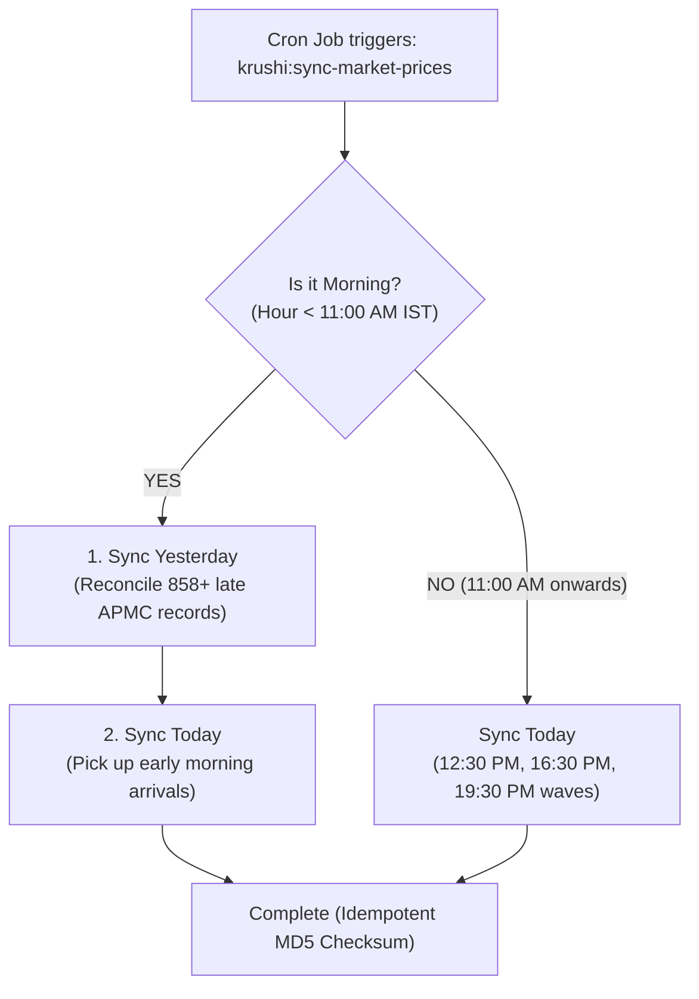

# KRAMA Daily Price Update Lifecycle & Cron Job Automation Plan

**Date:** 2026-09-29  
**Version:** 1.0  
**Target Architecture:** cPanel Shared Hosting & Laravel Scheduler  
**Status:** Implementation Ready  

---

## 1. Executive Summary

Based on live testing on **KRAMA (Karnataka State Agricultural Marketing Board)** servers:
* **Mid-Day State (13:42 IST)**: KRAMA has already processed **330 records** (morning arrivals, vegetable & perishable auctions).
* **End-of-Day State (Evening)**: KRAMA completes **858+ records** (covering commercial crops: Arecanut, Paddy, Cotton, Pulses across all 31 districts).
* **Sundays**: APMCs across Karnataka are closed (Mandi holiday).

To align Krushi Baandhava with the real-world flow of Karnataka APMC market yards, the automated cron job must operate on a **multi-wave daily schedule**:
1. **06:00 AM IST (Morning Reconciliation)**: Reconciles yesterday's late-night submissions and opening arrivals.
2. **12:30 PM IST (Mid-Day Perishables Wave)**: Ingests morning vegetable, fruit, and perishable mandi auctions (Tomato, Onion, Chilli).
3. **16:30 PM IST (Afternoon Commercial Bids)**: Ingests newly closed electronic tenders for Arecanut (Shivamogga, Sagar, Sirsi), Paddy, Maize, Cotton.
4. **19:30 PM IST (Final Evening Closing Rates)**: Ingests the complete daily closing report (~850+ records).
5. **Intraday Hourly Sync (10:00 AM – 05:00 PM IST)**: Checks for new APMC reports every hour during active market hours.

---

## 2. Admin Panel Cron Job Setup & Status Monitor (Current State & Verification)

### Is it Already in the Admin Panel?
**YES.** The cPanel Cron Job Status & Scheduler Monitor has been integrated into:
1. **Admin Dashboard (`/admin/dashboard`)**: Located prominently at the top of the dashboard.
2. **Data Sources Management (`/admin/datasources`)**: Located in the Automated Scheduling banner.

### Features Available in the Admin Panel:
* **Live Status Pulse Indicator**:
  * 🟢 **`CRON RUNNING & ACTIVE`**: Animated green pulse when a heartbeat was recorded in the last 15 minutes.
  * 🔴 **`CRON NOT RUNNING / SETUP REQUIRED`**: Warning alert if cPanel cron has stopped or is not yet configured.
* **Exact cPanel Command with 1-Click Copy**:
  ```bash
  * * * * * cd /home/username/public_html && php artisan schedule:run >> /dev/null 2>&1
  ```
  *(Automatically detects project path and PHP binary).*
* **⚡ Test Scheduler Tick Button**:
  * Allows administrators to manually trigger `schedule:run` and verify heartbeat instantly without waiting for cPanel.
* **Expandable Schedule Timings Editor**:
  * Allows updating Morning (`06:00`), Mid-Day (`12:30`), and Evening (`19:30`) timings directly from the UI.
* **Automated Background Tasks Inventory**:
  * Displays all 5 scheduled background jobs (Market Prices, Weather, Nightly Historical Stats, Holt's AI Forecasts, 1-Year Retention Pruner).

---

## 3. Implementation Plan: Intelligent Dual-Wave Morning Ingestion

### Objective:
Ensure that when the 06:00 AM morning cron job triggers, it does not fetch an empty table for "today" (since today's auctions haven't started). Instead, it should intelligently reconcile **yesterday's late-night closing records** AND fetch early opening boards.

### Implementation Steps:



1. **Step 1: Update `app/Console/Commands/SyncMarketPricesCommand.php`**:
   * If `--date` is omitted and the command runs in the morning (`hour < 11`):
     * Resolve target reconciliation date: if yesterday was Sunday, reconcile Saturday (`subDays(2)`), otherwise yesterday (`subDay()`).
     * Ingest target reconciliation date to ensure 100% completion of the previous trading day.
     * Ingest today (`Carbon::today()`) to capture any early arrivals.
   * If running after 11:00 AM (mid-day, afternoon, evening):
     * Ingest today (`Carbon::today()`).

2. **Step 2: Update System Default Settings (`SystemSettingSeeder.php` & Live DB)**:
   * `cron_market_morning_time`: `06:00`
   * `cron_market_afternoon_time`: `12:30`
   * `cron_market_evening_time`: `19:30`
   * `cron_market_enable_hourly`: `true`
   * `cron_market_operating_days`: `mon_sat`

3. **Step 3: Update `routes/console.php`**:
   * Ensure default fallbacks in `console.php` reflect `06:00`, `12:30`, and `19:30`.

4. **Step 4: Verification & Testing**:
   * Run `php artisan krushi:sync-market-prices --dry-run` to verify execution.
   * Run `php artisan schedule:list` to verify next due times.
   * Confirm Admin Dashboard displays the updated timings.
