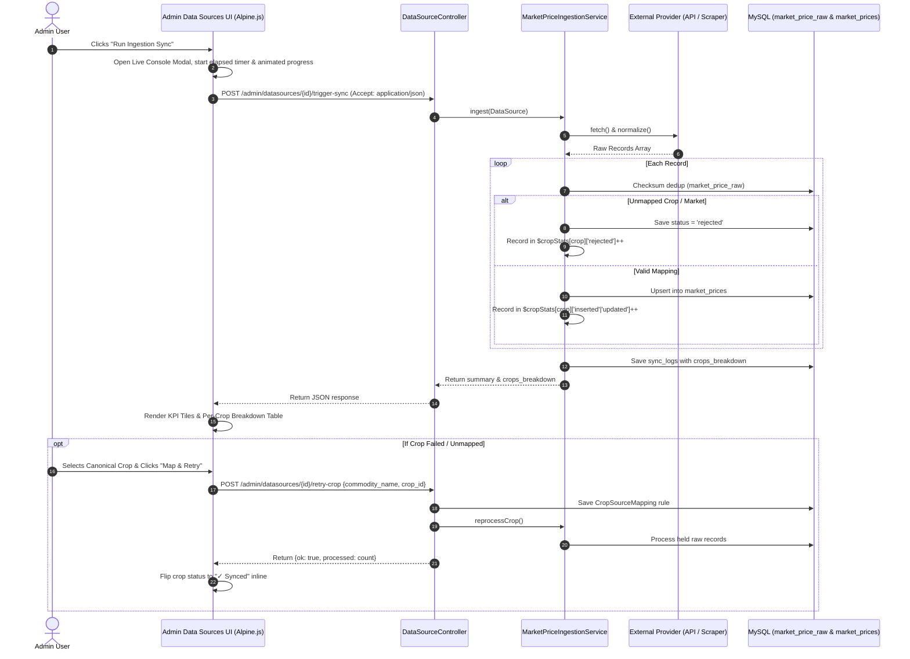

# Live Ingestion Sync Console: Per-Crop Breakdown & 1-Click Retry Mechanism

## Executive Summary
This document specifies the architecture, data flow, API design, and UI implementation for the **Live Ingestion Sync Console** under **Admin > Data Sources** (`admin/datasources`).

### Problem Statement
1. Clicking **"Run Sync Now"** currently triggers a synchronous full-page HTML form POST.
2. The user sees no loading indicator, spinner, or progress while external government APIs or scrapers are fetching data (3–15 seconds).
3. The response only returns a small top banner without showing **which crops were synced**, **how many records per crop were updated**, or **which crops failed**.
4. If a crop feed failed due to an unmapped alias, the admin has no quick way to map and retry syncing that specific crop from the console.

### Objective
1. **Interactive Real-Time Modal**: Immediate feedback on click, animated stage progress, and elapsed latency counter.
2. **Per-Crop Ingestion Breakdown**: Table showing every crop detected in the feed, with counts for New, Updated, and Rejected records.
3. **1-Click Inline "Map & Retry"**: For any rejected/unmapped crop, allow selecting the canonical crop inline and retrying ingestion instantly without page reload.
4. **Historical Persistence**: Save the crops breakdown into `sync_logs.details['crops_breakdown']`.

---

## Technical Architecture



---

## Detailed Implementation Steps

### 1. Ingestion Telemetry Extension
- **File**: `app/Services/Ingestion/MarketPriceIngestionService.php`
- Track `$cropStats = []` during `ingest()`:
  - `crop_name`: display name of the commodity
  - `crop_id`: canonical crop ID (if resolved)
  - `status`: `'synced'`, `'partial'`, or `'rejected'`
  - `received`, `inserted`, `updated`, `duplicate`, `rejected`
  - `rejection_reasons`: array of distinct error strings
- Add `reprocessCrop(int $dataSourceId, string $commodityName)` to reprocess held raw records for a specific commodity.

### 2. Controller & Routing
- **File**: `app/Http/Controllers/Admin/DataSourceController.php`
- **Method**: `triggerSync`
  - Support `Accept: application/json` returning structured telemetry.
- **New Method**: `retryCrop`
  - Creates verified alias mapping if `crop_id` supplied.
  - Re-executes `reprocessCrop()`.
- **New Method**: `retryAll`
  - Re-executes `reprocessBatch()`.
- **Routes**: `routes/web.php`
  - `POST /datasources/{datasource}/retry-crop`
  - `POST /datasources/{datasource}/retry-all`

### 3. UI Upgrade (`resources/views/admin/datasources/index.blade.php`)
- Replace static form submit with `@click="runSync(url, name, id)"`.
- Add **Live Ingestion Console Modal**:
  - Elapsed timer & animated progress indicator.
  - High-level KPI summary cards (Fetched, Inserted, Updated, Rejected, Latency).
  - **Crops Ingestion Breakdown Table**:
    - Crop Name with photo/icon
    - Status badge (Synced / Partial / Unmapped)
    - Count metrics (New, Updated, Rejected)
    - Action button (View Prices vs 1-Click Map & Retry)
  - Inline Quick-Mapping drawer for rejected commodities.

### 4. Verification & Testing
- Add `tests/Feature/AdminDataSourceSyncConsoleTest.php`.
- Test JSON trigger sync, per-crop breakdown response, and inline crop retry.
- Test batch sync-all endpoint `POST /admin/datasources/sync-all`.
- Verify entire test suite passes (232 tests green).

---

## 5. Date Resolution & Batch Multi-Source Sync Architecture

### How Today's Date is Dynamically Resolved
Every time ingestion is triggered (either manually or via the scheduler), the application targets **today's calendar date** (`Carbon::today()` / `2026-09-26`):

1. **CEDA Agmarknet Provider (`CedaAgmarknetDataProvider`)**:
   - Upstream API accepts `from_date` and `to_date`.
   - `to_date` dynamically defaults to `Carbon::today()->format('Y-m-d')` (`2026-09-26`).
2. **data.gov.in Mandi Provider (`DataGovMarketDataProvider`)**:
   - Queries latest APMC records for Karnataka.
   - Extracts arrival date from record `arrival_date` / `Arrival_Date` (e.g. `26/09/2026`). If omitted or malformed, defaults to `Carbon::today()->format('Y-m-d')`.
3. **TSS Sirsi Arecanut Tender (`TssSirsiDataProvider`)**:
   - Scrapes daily tender closing auctions and timestamps with `Carbon::today()->toDateString()`.
4. **Commodity Boards (Coconut & Coffee Boards)**:
   - Scrapes official daily market bulletin sheets and stamps with `Carbon::today()->format('Y-m-d')`.
5. **Ingestion Engine Safeguard (`MarketPriceIngestionService`)**:
   - Before upserting to `market_prices`, validates that `price_date` is not in the future; if so, clamps to `Carbon::today()`.

### Multi-Source Batch Ingestion (`Sync All Sources for Today`)
- **Route**: `POST /admin/datasources/sync-all` (`admin.datasources.sync-all`)
- **Controller Action**: `DataSourceController::syncAll`
- **UI Trigger**: Top header button **"🔄 Sync All Sources (Today: 26 Sep)"**
- Sequentially executes ingestion for all active providers, accumulating a consolidated breakdown across all feeds, and renders the unified report in the Live Ingestion Sync Console without page reload.

---

## 6. Admin Panel Cron Schedule Timings Management

### Overview
Admins can directly configure and update the Automated Background Cron (Runs on Schedule) timings from the **Data Sources & Adapters** interface (`admin/datasources`) without touching code or editing server configuration files.

### Configuration Controls Available:
1. **🌅 Morning Ingestion Time (IST)**: Configures opening arrivals sync (e.g. `06:00` or custom time like `07:15`).
2. **🌇 Evening Ingestion Time (IST)**: Configures final closing auction rates sync (e.g. `18:00` or custom time like `19:30`).
3. **☀️ Mid-Day Ingestion Time (IST)**: Optional afternoon price refresh (e.g. `13:00` or disabled).
4. **⚡ Hourly Trading Sync**: Checkbox toggle to automatically poll rates every hour during active APMC mandi trading sessions (10:00 AM – 05:00 PM).
5. **🗓️ Operating Days**: Mon–Sat (skipping Sunday mandi holidays) or All 7 Days.
6. **Automatic Propagation**: Automatically updates `sync_time`, `sync_frequency`, and `sync_days` across all active `data_sources` in the database.

### Dynamic Pipeline Execution:
- **Routes**: `POST /admin/datasources/update-schedule-timings` (`admin.datasources.update-schedule-timings`)
- **Storage**: Persisted into [`system_settings`](file:///d:/xampp/htdocs/Krushi-Baandhava-application/app/Models/SystemSetting.php) under keys:
  - `cron_market_morning_time`
  - `cron_market_evening_time`
  - `cron_market_afternoon_time`
  - `cron_market_enable_hourly`
  - `cron_market_operating_days`
- **Console Scheduling (`routes/console.php`)**: Dynamically reads these settings on every scheduler cycle, scheduling commands dynamically and evaluating `$source->isDue()` every 15 minutes.

---

## 7. Ingested Crops Breakdown Table Rendering Architecture

### Issue & Root Cause
When clicking **"Run Ingestion Sync"**, the server successfully returned all telemetry along with the array of ingested crops (`crops: [...]`), and the status pills showed the correct counts (e.g. `All (12)`, `Synced (12)`). However, the table body beneath `Commodity / Crop | Status | Ingestion Stats | Actions` was visually blank.
- **Root Cause**: The Blade template used a nested `<template x-data="{}">` inside `<template x-for="...">` in an attempt to group the main row and the expandable quick-mapping drawer row. In Alpine.js and HTML5 DOM specifications, `<template>` tags without an active directive (`x-if` or `x-for`) remain inert document fragments (`template.content`) that browsers never render to the screen. Furthermore, Alpine v3 limits `<template x-for>` to a single root element.

### Solution
1. **Per-Crop `<tbody>` Partitioning**: In accordance with the HTML5 specification (which permits multiple `<tbody>` elements per `<table>`), the loop iterates at the `<tbody>` level:
   ```html
   <template x-for="crop in getFilteredCrops()" :key="crop.raw_name || crop.crop_name">
       <tbody class="divide-y divide-slate-800/60 border-t border-slate-800/40">
           <!-- Main Row -->
           <tr class="hover:bg-slate-900/50 transition"> ... </tr>
           <!-- Inline Quick-Mapping Drawer Row -->
           <tr x-show="crop.drawerOpen" class="bg-slate-950/90 border-b border-slate-800"> ... </tr>
       </tbody>
   </template>
   ```
2. **Image-Free Compact Layout**: Replaced heavy external `` elements with lightweight agricultural badge icons (`🌾`) and structured typography (canonical title + raw mandi name), eliminating all layout distortions and image dimension shifts.
3. **Empty Filter State**: Separated into its own conditionally displayed `<tbody x-show="getFilteredCrops().length === 0">`.
4. **Modal Viewport & Sticky Header Positioning**:
   - Replaced fragile outer `flex items-center` with standard `flex min-h-full items-start sm:items-center justify-center p-3 sm:p-5 text-center` and dialog `my-auto max-h-[calc(100vh-2rem)] sm:max-h-[85vh]`.
   - Made the Modal Header `sticky top-0 z-20 shrink-0 bg-slate-900/95` and Footer `sticky bottom-0 z-20 shrink-0 bg-slate-950` so the title, status pill, provider info, and `✕` close button remain permanently pinned and visible on all screen sizes.
   - Constrained the crops table wrapper with `max-h-80 overflow-y-auto` and `sticky top-0` table header for a tidy, scrollable list.


