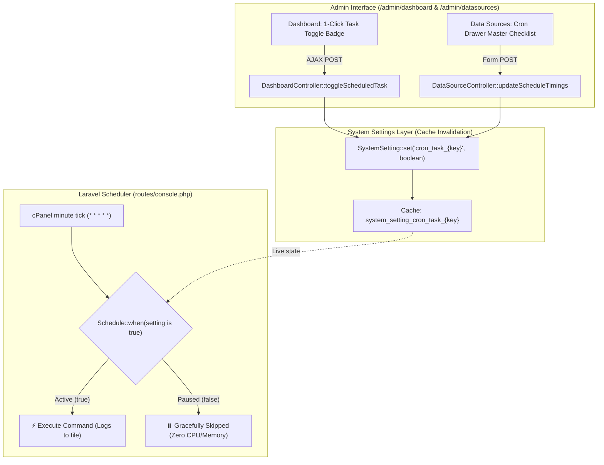

# Scheduled Cron Tasks Master Controls Implementation Plan

**Date:** 2026-10-03  
**Version:** 1.0  
**Target:** Admin Dashboard, cPanel Scheduled Tasks, System Settings & Console Kernel  
**Status:** In Implementation  

---

## 1. Problem Statement

Under **Admin Dashboard (`/admin/dashboard`) ➔ cPanel Cron Job & Automated Scheduler**, the system displays a table:
**"🤖 Tasks Handled Automatically by this Cron"** listing 5 core automated operations:
1. 🌾 Mandi Market Prices Ingestion (`06:00, 12:30, 19:30, Hourly`)
2. 🌦️ Hyperlocal Weather Advisories & Cache Pruning (`03:30 IST`)
3. 📊 Historical Analytics & Seasonality (`01:00 IST`)
4. 🔮 Price Forecasting Engine (`02:00 IST`)
5. 🧹 1-Year Rolling Retention Pruner (`23:00 IST`)
6. 🛡️ Data Integrity Auditor (`20:30 IST`)

Currently:
* The status column shows a static, unclickable badge: `Auto`.
* In [`routes/console.php`](file:///d:/xampp/htdocs/Krushi-Baandhava-application/routes/console.php), all commands are unconditionally queued in the scheduler without checking administrative preference.
* Administrators have no ability to pause a specific heavy task (e.g. pausing the AI Forecasting Engine or Analytics during server maintenance or high traffic) without modifying code or stopping the entire cPanel cron daemon.

---

## 2. Architecture & Design Principles

### Core Design Rules:
1. **Zero cPanel Reconfiguration**: Administrators do *not* need to touch cPanel cron jobs. The single `* * * * * php artisan schedule:run` command remains untouched.
2. **Dynamic Runtime Evaluation (`->when()`)**: Uses Laravel's native scheduler conditional execution: `Schedule::command(...)->when(...)`. Pausing a task takes effect instantly without server restarts.
3. **Audit Logging**: Every pause/resume action is permanently recorded in `audit_logs` with admin email, timestamp, and previous vs new states.
4. **Manual Run Preservation**: Pausing a task in the cron schedule does *not* disable running it manually via terminal (e.g., `php artisan krushi:generate-forecasts` on-demand continues to work).

---

## 3. Phased Implementation Roadmap

### Phase 1: Setting Keys Definition & State Mapping
* Task Keys and default configurations:
  * `mandi_prices`: `cron_task_mandi_prices` (default: `true`)
  * `weather_sync`: `cron_task_weather_sync` (default: `true`)
  * `analytics_stats`: `cron_task_analytics_stats` (default: `true`)
  * `forecasting`: `cron_task_forecasting` (default: `true`)
  * `retention_pruning`: `cron_task_retention_pruning` (default: `true`)
  * `data_integrity`: `cron_task_data_integrity` (default: `true`)

### Phase 2: Scheduler Conditional Execution (`routes/console.php`)
* Attach `->when(fn () => \App\Models\SystemSetting::get('cron_task_{key}', true))` to all 6 scheduled background commands.

### Phase 3: Controller Endpoints & Settings Sync
* **Route**: `POST /admin/scheduler/toggle-task` &rarr; `DashboardController@toggleScheduledTask`.
* **DashboardController**:
  * Return live task status dictionary in `$cronStatus['tasks']`.
  * Handle AJAX / JSON toggle requests with audit logging.
* **DataSourceController**:
  * In `updateScheduleTimings`, accept optional `scheduled_tasks` array to allow saving all master switches from the Drawer.

### Phase 4: UI Updates in Admin Dashboard (`/admin/dashboard`)
* Transform the static `Auto` column in the **Tasks Handled Automatically by this Cron** table into interactive 1-click AJAX toggle buttons:
  * `⚡ Active` (Emerald pill)
  * `⏸️ Paused` (Amber/Slate pill)
* Real-time UI updates with CSRF protection and zero full-page reloads.

### Phase 5: UI Updates in Data Sources Cron Drawer (`/admin/datasources`)
* Add a dedicated **"Scheduled Background Tasks Master Switches"** block inside the expandable Cron Timings drawer.

### Phase 6: Automated Testing & Verification
* Feature test suite covering:
  * Toggle endpoint authorization and mutations.
  * Conditional scheduler evaluation.
  * End-to-end regression testing.
