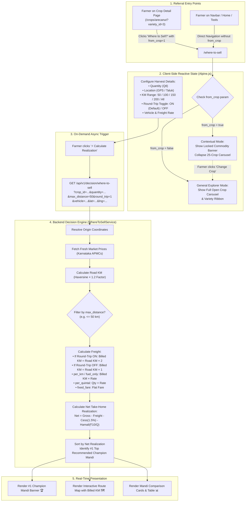

# Phase-Wise Implementation Plan: Where-to-Sell KM Range Filter, Round-Trip Freight, and Contextual Commodity Locking

**File Reference:** `docs/WHERE_TO_SELL_KM_RANGE_ROUND_TRIP_AND_CONTEXT_LOCKING_PLAN.md`  
**Target Module:** Net Realization Decision Engine & Where-to-Sell Simulator (`/where-to-sell`)  
**Status:** Approved for Implementation  
**Version:** 1.0 (Enterprise Agri-Tech Grade)

---

## 📋 Executive Summary

This document specifies the phase-wise engineering blueprint to introduce three advanced decision features to the **Where-to-Sell Net Realization Simulator**:

1. **KM Range / Search Radius Filter (50km, 100km, 150km, 200km, All Karnataka)**:
   Enables farmers to restrict the market optimization engine to their preferred road haul distance. The #1 Champion Mandi and comparative analysis adapt strictly to the chosen radius.
2. **Round-Trip Freight Calculation Toggle (Default: Active / True)**:
   Aligns freight cost with real-world Indian agricultural transport realities, where hired vehicles (Piaggio Ape, Bolero Pickup, Tata 407) bill for two-way mileage ($\text{Farm} \rightarrow \text{Mandi} \rightarrow \text{Farm}$). Supports toggling OFF for shared backloads or one-way freight.
3. **Contextual Commodity Locking**:
   When a farmer clicks *"Where to Sell?"* from a specific crop detail page, the simulator locks in the pre-selected crop and commercial variety, collapsing the 25-crop carousel into a sleek, focused **Selected Commodity Summary Card** with a smooth `[Change Crop / ಬೆಳೆ ಬದಲಾಯಿಸಿ ▾]` expand toggle. Direct navigation to `/where-to-sell` continues to provide the full open carousel.

---

## 🏛️ System Architecture & Data Flow



---

## 🚀 Phase-Wise Implementation Breakdown

---

### Phase 1: Core Mathematical Service & API Extension

**Objective:** Equip `WhereToSellService` and `WhereToSellApiController` to handle search radius filtering and round-trip transport mileage doubling.

#### 1.1 `WhereToSellService.php` Enhancements:
1. **Extract & Validate Options**:
   ```php
   $maxDistance = !empty($options['max_distance']) ? (float) $options['max_distance'] : null;
   $isRoundTrip = filter_var($options['round_trip'] ?? true, FILTER_VALIDATE_BOOLEAN);
   ```
2. **Compute Billed Mileage**:
   ```php
   // Straight-line and road distance (one-way)
   $straightKm = $this->calculateHaversineDistance($origin['latitude'], $origin['longitude'], (float)$market->latitude, (float)$market->longitude);
   $roadKm = round($straightKm * self::ROAD_FACTOR, 1);
   $transitHours = round($roadKm / 40.0, 1);

   // Two-Way Billed Mileage when Round-Trip is active
   $billedKm = $isRoundTrip ? round($roadKm * 2, 1) : $roadKm;
   ```
3. **Freight Calculation Rules**:
   - `per_km`: `max($vehicle['min_fare'] ?? 0, round($billedKm * $vehicle['rate_per_km'], 2))`
   - `fuel_only`: `round($billedKm * $customVal, 2)`
   - `per_quintal`: `round($quantityQuintals * $customVal, 2)` (Unit-based freight independent of vehicle return)
   - `fixed_fare`: `round($customVal, 2)` (Lumpsum flat rate independent of distance)
4. **Distance Radius Filtering (`max_distance`)**:
   ```php
   if ($maxDistance && $maxDistance > 0) {
       $candidates = $candidates->filter(fn($c) => $c['distance_km'] <= $maxDistance)->values();
   }
   ```
5. **Candidate Payload Expansion**:
   Expose `billed_km`, `is_round_trip`, and `max_distance` in the response array so the frontend can display transparent mileage breakdowns.

#### 1.2 `WhereToSellApiController.php` Extension:
- Accept `max_distance` (float, nullable) and `round_trip` (boolean, default true) from `$request` and forward to `$decisionService->compare()`.

#### 1.3 `WhereToSellController.php` Extension:
- Pass `$isContextual` flag to view if `from_crop` is present or if `crop` and `variety_id` were passed in query parameters.

---

### Phase 2: Upstream Referral Context Passing

**Objective:** Connect the *Crop Detail Page* seamlessly to the *Where to Sell Simulator*.

#### 2.1 `resources/views/farmer/crops/show.blade.php`:
- Update the **"Where to Sell? (ಎಲ್ಲಿ ಮಾರಾಟ?)"** button link:
  ```blade
  @php
      $whereToSellParams = array_filter([
          'crop' => $crop->slug,
          'variety_id' => $activeVarietyId ?? ($activePriceItem?->variety_id ?? null),
          'market_id' => $selectedMarket?->id,
          'district_id' => $selectedMarket?->district_id ?? ($userDistrict?->id ?? null),
          'from_crop' => 1,
      ]);
  @endphp
  <a href="{{ route('farmer.decision.where-to-sell', $whereToSellParams) }}" ...>
  ```

---

### Phase 3: Simulator Frontend UI & Reactive Controls

**Objective:** Build clean, touch-friendly UI controls in `where_to_sell.blade.php`.

#### 3.1 Subphase 3A: Contextual Commodity Card with Expand/Collapse Toggle
- When `isContextual` is active:
  - Render a compact, dark-green card showing:
    - Traded Crop Name (English & Kannada)
    - Commercial Variety Name (English & Kannada)
    - Badge: `🔒 Context Locked` / `ಆಯ್ಕೆಮಾಡಿದ ಬೆಳೆ`
    - Action button: `Change Crop / ಬೆಳೆ ಬದಲಾಯಿಸಿ ▾`
  - When the user taps `Change Crop`, smooth slide-down reveals the horizontal 25-crop carousel and variety ribbon.
- When visiting `/where-to-sell` directly without `from_crop`:
  - Full carousel and variety ribbon remain visible and open by default.

#### 3.2 Subphase 3B: KM Range / Radius Filter Chips
- Add **Search Radius / KM Range** under the Location Step:
  - Preset options:
    - `50 km` (ಸ್ಥಳೀಯ / 50 ಕಿ.ಮೀ)
    - `100 km` (100 ಕಿ.ಮೀ)
    - `150 km` (150 ಕಿ.ಮೀ)
    - `200 km` (200 ಕಿ.ಮೀ)
    - `All Karnataka` (ಯಾವುದೇ ಮಿತಿ ಇಲ್ಲ - All)
  - Selecting a chip updates `maxDistance = 50`, marks `hasUncalculatedChanges = true`, and waits for the user to click **"⚡ Calculate Realization"**.

#### 3.3 Subphase 3C: Round-Trip Freight Toggle Switch
- Add a dedicated toggle switch under **Step 4 (Freight Calculation)**:
  - **Label**: `🔄 Round-Trip Freight (ಹೋಗಿ-ಬರಲು ಬಾಡಿಗೆ)`
  - **State**: Default **Active (`roundTrip = true`)**
  - **Visual Indicator**: Shows `2x Distance Active` badge when ON, and `One-Way Only` when OFF.
  - Toggling marks `hasUncalculatedChanges = true`.

#### 3.4 Subphase 3D: Mileage & Deduction Breakdown Badges
- Update Mandi Cards, Table View, and Leaflet Map Popups:
  - Display:
    - If Round-Trip ON: `🛣️ 45 km (90 km Round-Trip)` / `🛣️ 45 ಕಿ.ಮೀ (90 ಕಿ.ಮೀ ಹೋಗಿ-ಬರಲು)`
    - If Round-Trip OFF: `🛣️ 45 km (One-Way)` / `🛣️ 45 ಕಿ.ಮೀ (ಒಂದು ಮುಖ)`

---

### Phase 4: Edge Cases, Localization & Error Handling

1. **Zero Mandis within Radius**:
   - If a farmer selects `50 km` in a remote area and no mandis trade that crop within 50 km:
     - Render an informative warning card with a one-click button: `Expand to 100 km` or `Show All Karnataka`.
2. **Bilingual Precision**:
   - All labels, tooltips, and badges provided in high-quality Kannada and English.
3. **PWA Mobile Responsiveness**:
   - Ensure the radius chips scroll smoothly on mobile screens with no text truncation.

---

### Phase 5: Verification & Quality Assurance

| Test Case | Expected Behavior |
|---|---|
| **5.1 KM Radius 50km** | Only mandis $\le 50\text{ km}$ appear in the results list and map pins. |
| **5.2 KM Radius Expand** | Tapping `150 km` and clicking Calculate re-evaluates all mandis $\le 150\text{ km}$. |
| **5.3 Round-Trip ON (Default)** | Transport cost for 100 km at ₹22/km equals $200\text{ km} \times ₹22 = ₹4,400$. |
| **5.4 Round-Trip OFF** | Transport cost for 100 km at ₹22/km equals $100\text{ km} \times ₹22 = ₹2,200$. |
| **5.5 Contextual Entry** | Coming from `/crops/arecanut?variety_id=3&from_crop=1` displays compact locked commodity card. |
| **5.6 General Direct Entry** | Visiting `/where-to-sell` directly displays full open crop carousel. |
| **5.7 On-Demand Trigger** | Changing KM range or round-trip does NOT auto-fetch until user clicks "Calculate Realization". |

---

## 📌 File Change Matrix

| File Path | Description of Changes |
|---|---|
| `app/Services/Market/WhereToSellService.php` | Add `max_distance` filter, `round_trip` doubling calculation, `billed_km` payload. |
| `app/Http/Controllers/Api/V1/WhereToSellApiController.php` | Accept `max_distance` and `round_trip` parameters. |
| `app/Http/Controllers/Farmer/WhereToSellController.php` | Pass `$isContextual` flag to view based on incoming request parameters. |
| `resources/views/farmer/crops/show.blade.php` | Add `from_crop=1` to "Where to Sell?" anchor button. |
| `resources/views/farmer/decision/where_to_sell.blade.php` | Add Contextual Commodity Card, KM range chips, Round-trip toggle, and updated badges. |

---

**Sign-off:** Ready for execution. All steps are backwards-compatible and non-destructive.
